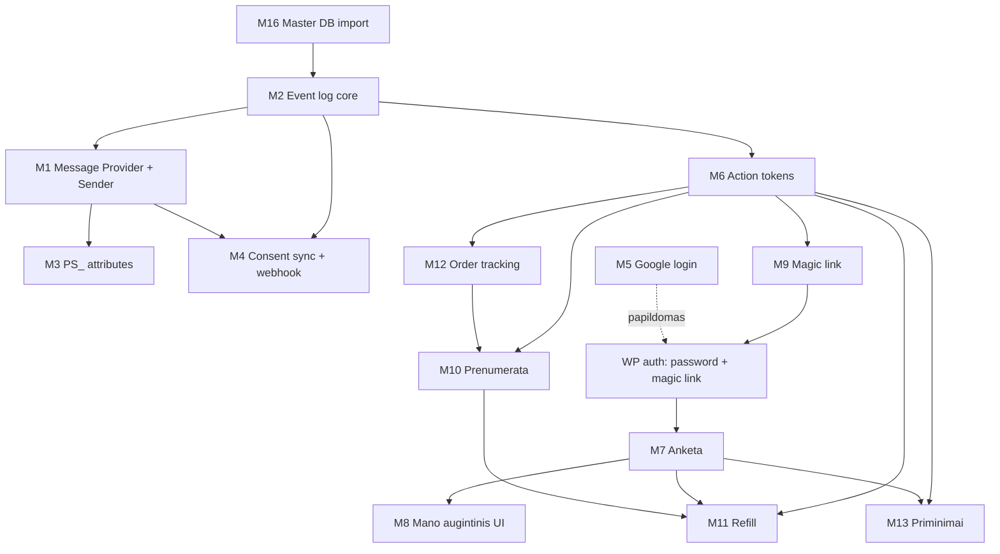

# Petshop.lt architektūros žemėlapis — v2

**Statusas:** GYVAS (S185, 2026-07-14). Pakeičia v1.
**Kontekstas:** Etapas A pusiaukelėje (M1-M4 baigti), prieš M6 tokenų sistemą — architektūra išvaloma nuo v1 klaidų.

---

## Kas pasikeitė nuo v1 (svarbu)

**3 esminės v1 klaidos, taisomos šioje versijoje:**

### Klaida #1: Event log buvo pririštas prie M1 adapterio

**v1:** Event log gyveno `petshop-esp` viduje (kartu su Sender adapter'iu).
**v2:** Event log — provider-neutral pamatas, gyvena `petshop-core`. Adapter'is (Sender, būsimas SMS provider, etc.) priklauso nuo core, ne atvirkščiai.

### Klaida #2: M6 (tokenai) priklausė nuo M5 (Google Identity)

**v1:** M6 buvo įrašytas kaip Google Identity → tokenai kelias.
**v2:** M6 tokenai NEPRIKLAUSO nuo M5. Signed tokenai naudoja `subject_id + resource_id + purpose + expires_at + nonce + key_id` — Google čia visai nedalyvauja. Priešingai: **M6 aptarnauja magic link**, kuris pakeičia M5 skubą.

Teisingas priklausomybės grafas:
```
M2 (event log core) → M6 (action tokens) → magic link login → PS_EMAIL_VERIFIED
M5 (Google) = papildomas prisijungimo būdas, ne architektūros pamatas
```

### Klaida #3: M5 kaip hard dependency M7/M8/M10 moduliams + M7 kaip priklausantis nuo M8

**v1:** Anketa (M7), „Mano augintinis" (M8), prenumerata (M10) buvo pririšti prie Google Identity. M7 buvo pastatytas po M8.
**v2:** Šie moduliai priklauso nuo **bendro WP autentifikacijos sluoksnio**, ne būtent Google:
- Password login (WP standard)
- Magic link (M6 tokenai)
- Google login (M5, papildoma)

M7 anketa yra **savarankiškas** komponentas. M8 „Mano augintinis" UI ją tik įterpia/išplečia.

Teisinga seka:
```
WP user auth (password + magic link)
        ↓
M7 anketa (savarankiška)  ─→  ps_pets DB
        ↓
M8 „Mano augintinis" UI (rodo/redaguoja anketą)
```

---

## Plugin architektūra — provider-neutralus pamatas

### Vienkryptė priklausomybė

```
                    ┌──────────────────────────┐
                    │      petshop-core        │  ← provider-neutralus pamatas
                    │  (Event, Tokens, Consent)│
                    └──────────────────────────┘
                                ↑
              ┌─────────────────┼─────────────────┐
              │                 │                 │
      ┌───────────────┐  ┌─────────────┐  ┌──────────────┐
      │ petshop-esp   │  │petshop-sms  │  │  petshop-*   │
      │ (Sender API)  │  │ (ateity)    │  │  (specifiniai│
      └───────────────┘  └─────────────┘  │   moduliai)  │
                                          └──────────────┘
```

**Taisyklė:** `petshop-esp` (ar bet kuris provider adapter) NIEKADA neimportuoja Petshop core biznio logikos tiesiogiai. Bendravimas per **interface + action/filter hooks**.

### petshop-core atsakomybė

```
petshop-core/
├── petshop-core.php                      Bootstrap, aktyvavimas, public API
├── includes/
│   ├── class-event-log.php               gaj6_ps_event_log DB sluoksnis
│   ├── class-event-registry.php          Kanoninių event schemų validatorius
│   ├── class-action-tokens.php           HMAC signed tokens (universal)
│   ├── class-consent-log.php             gaj6_ps_consent_log (teisinis įrodymas)
│   ├── class-consent-sync.php            Woo consent hooks (provider-neutral)
│   ├── interface-message-provider.php    Contract, kurį įgyvendina ESP/SMS
│   └── class-retry-queue.php             Action Scheduler backoff (visiems provider'iams)
└── schemas/
    └── events/                           13 kanoniniai .schema.json
```

Public API (Petshop core):
- `ps_emit_event($name, $email, $payload)` — event log + async processing
- `ps_generate_token($purpose, $subject_id, $resource_id, ...)` — HMAC token
- `ps_verify_token($raw_token)` / `ps_consume_token($raw_token)`
- `ps_set_marketing_consent($email, $consent, $source, $customer_id)`
- `ps_get_marketing_consent($email)`
- `do_action('petshop_contact_update', $email, $attributes)` — provider'iai klauso

### petshop-esp atsakomybė (tik Sender specifika)

```
petshop-esp/
├── petshop-esp.php                       Bootstrap, require petshop-core
├── includes/
│   ├── class-sender-adapter.php          implements Petshop_Message_Provider
│   ├── class-sender-webhook-receiver.php Sender-specifinis HMAC parašo formatas
│   └── class-sender-field-mapper.php     PS_ laukų → Sender columns[] transformacija
```

Sender adapter:
- Klauso `petshop_contact_update` → verčia į Sender API
- Klauso `ps_esp_process_event` (retry queue hook) → siunčia event į Sender
- **Dev hard allowlist** viduje (žr. saugumas žemiau)

### Migracija iš v1 (S185-S186)

Šiuo metu `petshop-esp` v0.3.0 turi visas core klases viduje (istoriškai). Migracija:
1. Sukurti `petshop-core` plugin
2. Perkelti klasės (be schema pakeitimų — DB lentelės tos pačios)
3. `petshop-esp` v0.4.0: require core, perkirpti iki tik Sender specifikos
4. Empirinis testas kad viskas veikia po migracijos

---

## 16 modulių — priklausomybės

### Modulių sąrašas

| # | Modulis | Vieta | Statusas |
|---|---|---|---|
| M1 | Message Provider Interface + Sender adapter | petshop-esp + core | ✅ |
| M2 | Event log + retry queue | petshop-core | ✅ |
| M3 | PS_ contact attributes | Sender | ✅ |
| M4 | Consent sync + webhook receiver | petshop-core (log/sync) + petshop-esp (webhook) | ✅ |
| M5 | Google Identity + legacy dedup | naujas plugin arba core | — |
| M6 | Action tokens (HMAC universal) | petshop-core | SEKANTIS |
| M7 | Anketa (pet profile) | petshop-core arba naujas | — |
| M8 | „Mano augintinis" UI | tema/plugin | — |
| M9 | Magic link login | petshop-core | — |
| M10 | Prenumerata | naujas plugin | — |
| M11 | Refill variklis | petshop-core | — |
| M12 | Order tracking (Venipak/LP Express hooks) | petshop-core | — |
| M13 | Priminimai (pet_reminder) | petshop-core | — |
| M14 | Homepage vartai | tema | — |
| M15 | Templates (email/SMS) | Sender + WP | — |
| M16 | Master DB import (legacy) | naujas plugin arba script | — |

### Priklausomybės (Mermaid)



**Svarbu:** M5 (Google) rodomas su punktyrine linija — jis yra **papildomas** prisijungimo būdas prie bendro WP auth sluoksnio, ne pagrindas. Sistema veikia be M5.

### Kritinis kelias (Etapo A launch)

```
M1 (esp adapter) ✅
    ↓
M2 (event log) ✅
    ↓
M3 (PS_ attributes) ✅
    ↓
M4 (consent sync + webhook) ✅
    ↓
M6 (action tokens) ← DABAR
    ↓
Event Registry + 3 realūs event schemas (order_paid, consent_changed, order_shipped)
    ↓
M9 (magic link login) — naudoja M6
    ↓
M7 (anketa) — naudoja M9 auth
    ↓
M11 (refill variklis) — naudoja M6 tokenus + M7 duomenis
    ↓
M12 (Venipak/LP hook order_shipped)
    ↓
M14/M15 (homepage + templates) — launch UI
    ↓
LAUNCH (2026-10-01)
```

**Ne kritinio kelio (po launch):**
- M5 Google login (kai magic link neišspręs trinties)
- M10 Prenumerata (Paysera admin proceso trukmė lems terminą)
- M13 Priminimai (P1 modulis)
- M16 Master DB legacy import (viena karta soft launch metu)

---

## DB lentelės (9 naujos, visos gaj6_ps_* prefiksu)

| Lentelė | Modulis | Statusas |
|---|---|---|
| gaj6_ps_event_log | M2 | ✅ (12 stulpelių, 5 indeksai) |
| gaj6_ps_consent_log | M4 | ✅ (10 stulpelių, 3 indeksai) |
| gaj6_ps_action_tokens | M6 | SEKANTIS |
| gaj6_ps_pets | M7 | — |
| gaj6_ps_reminders | M13 | — |
| gaj6_ps_reminders_recurring | M13 | — |
| gaj6_ps_subscriptions | M10 | — |
| gaj6_ps_subscription_events | M10 | — |
| gaj6_ps_refill_predictions | M11 | — |
| gaj6_ps_identity_links | M5 | — |

Visos lentelės — `petshop-core` install/maybe_install atsakomybė.

---

## Saugumo principai (nauji v2)

### 1. Dev hard allowlist provider'io lygmenyje

Provider adapter'is (SenderAdapter) turi **hard allowlist konstantoje** (ne DB):

```php
const DEV_ALLOWLIST = array(
    'terra@gyvunai.lt',
    'raimundas@gyvunai.lt',
);

public function upsert_contact( $email, $attrs ) {
    if ( defined('PETSHOP_ENVIRONMENT') && PETSHOP_ENVIRONMENT === 'dev' ) {
        if ( ! in_array( $email, self::DEV_ALLOWLIST, true ) ) {
            $this->log_blocked( $email, 'dev_env_not_allowlisted' );
            return array( 'ok' => true, 'skipped' => 'dev_allowlist' );
        }
    }
    // ...
}
```

Grupės filtras Sender ekrane nėra pakankama apsauga. Saugumas turi būti kode.

### 2. Tokenų scanner-safe modelis

Email robotai (Outlook Safe Links, antivirusai) automatiškai atidaro visas laiško nuorodas GET metodu. Todėl **GET niekada nevykdo negrįžtamo veiksmo**.

Teisingas modelis:
```
Laiške: <a href="https://petshop.lt/action/{token}">Patvirtinti</a>
    ↓ GET
Puslapis parodo: "Ar tikrai norite atšaukti prenumeratą?"
    ↓ user paspaudžia „Patvirtinti"
POST /action/{token}
    ↓
Veiksmas įvyksta, tokenas + susiję to paties ciklo tokenai invaliduojami
```

Išimtis: idempotentiniai read-only veiksmai (magic link kur token'as tik autentifikuoja, o realus login vyksta per POST formą).

### 3. HMAC key rotation

Tokenai neša `key_id`, kuris nurodo kurio HMAC secret'o versija panaudota. Keys saugomi `wp_options` masyve `{'v1': 'secret1', 'v2': 'secret2', ...}`. Verify tikrina su nurodytu key_id. Naujas token — visada su naujausiu key_id. Rotation įvyksta be visų senų tokenų invalidacijos.

### 4. Magic link kritinis srautas — per SMTP, ne Sender

Auth laiškai (magic link, password reset) eina per WP Mail SMTP (isopas.serveriai.lt), **ne per Sender**. Priežastis: jei Sender guli, auth turi veikti. Tas pats principas kaip email routing sprendime — kritiniai transakciniai = WC/SMTP, marketing/lifecycle = Sender.

Papildomi magic link reikalavimai:
- Vienodas atsakymas egzistuojančiam ir neegzistuojančiam email (info leak apsauga)
- Rate limit pagal IP + email
- TTL 15-30 min
- Vienkartinis naudojimas
- Sesijos ID regeneravimas po sėkmingo login
- **Nekurti naujos paskyros automatiškai** (magic link tik esamiems)
- PS_EMAIL_VERIFIED — tik veidrodinis laukas Sender pusėje, tiesa Woo user_meta

---

## Sekantis planas (S185+)

**S185 (dabar):** Šis dokumentas + event registry (dokumentacija).
**S186:** `petshop-core` plugin sukūrimas + migracija iš `petshop-esp`.
**S187:** `Petshop_Action_Tokens` implementacija su scanner-safe pattern.
**S188:** Event Registry + JSON schemos 13 event'ams.
**S189:** Realūs event'ai: `order_paid`, `consent_changed`, `order_shipped` (su Venipak hook recon).
**S190:** E2E testas per PS_TEST grupę + hard dev allowlist.
**S191:** Magic link per WP Mail SMTP.
**S192+:** M7 anketa → M11 refill → likę event'ai.
